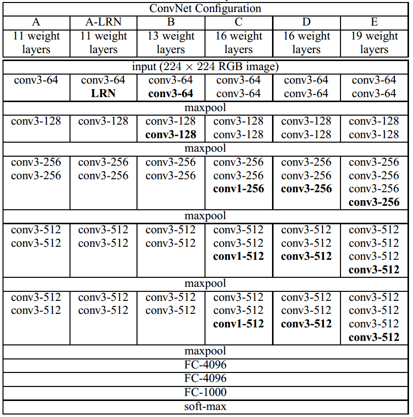

# 读懂CNN（VGG）

##  1.  vgg的网络结构图

​	

## 2. 卷积核对计算和特征识别结果的影响

### 2.1  2个3*3kernel 叠加，卷积后特征尺寸等同于1个 5* *5 卷积

### 2.2 优点

	1. 小卷积的串联比使用相同感受野的卷积少很多参数量

​		>   以3个3 * 3 卷积核1 个7 * 7 卷积层为例：

​		

​		3 * 3 * 3 * Cin   * Cout / (7 * 7 * Cin * Cout) = 55%

 2. 更多的非线性变化

    3 个卷积层比1个卷积层要多两次非线性变化， 这就意味网络对特征的学习能力更强

### 2.3 拓展

那么比3 * 3 更小的卷积： 1 * 1 卷积核的作用是什么呢？

> 答： 一种为决策增加非线性因素的方式， 调整网络维度推广或者缩小维度。
>
> eg: mobilnet 使用1 * 1 的卷积核来扩维， resnet 使用1 * 1 卷积核来缩小维度

### 2.4 迁移学习

使用训练好的神经网络模型，来训练自己的数据集合。即使用训练好的权重来初始化网络，并不是随机初始化。
在实践中，我们通常不会完全重头开始随机初始化训练，能满足深度网络需求的足够大小的数据集相当少见。作为替代，通常是在一个大型数据集上预训练一个网络，然后使用该网络的权重作为初始设置或作为相关任务的固定的特征提取器。
可以

> 1. 有效提高网络精度
>
> 2. 更好的拟合自己的数据，减少训练量。
>
> 3. 可以使用更少数据达到更好的效果。
>
>    
>
>    总之，使用Fine tune能节省时间和资源。

#### 原理

神经网络浅层学习的是通用特征即基础特征，比如边缘，轮廓颜色等特征。深层是针对特定数据的更抽象的特征。全连接层就是对特征进行组合并评分分类。
因此，我们可以利用网络前几层学习到的通用特征，仅让网络学习数据的抽象特征，节省资源和时间。

#### 应用

微调策略取决于很多因素，但最重要的两个是（1）新数据集大小。（2）新数据集与原数据集的相似度。

> 新数据集小，内容上相似：这种情况下，通常只需要训练最后的输出层，即最后一层，因为可能分类的数量不同，最后一层需要做修改。
>
> 新数据集大，内容上相似：最理想情况，可以微调整个网络，因为数据集足够大不用担心过拟合
>
> 新数据集小，内容不相似：使用微调效果不是很好，可以尝试冻结前面大部分卷积层，重新训练网络的高超卷积层及全连接层
>
> 新数据集大，内容不相同：由于数据集很大，且相似度比较低，最好重头开始训练整个网络。

### 3. 网络详解

####  3.1 网络权重参数数量计算

> kernel_H * kernel_W * C_in * C_out 
>
> 注： kernel_H 卷积核高  kernel_W 卷积核宽  C_in 输入通道数 C_out 输出通道数
>
> （卷积操作和全连接操作有需要计算的参数，池化没有）

#### 3.2 VGG 网络特点

* 结构简洁
  VGG由5层卷积层、3层全连接层、softmax输出层构成，层与层之间使用max-pooling（最大化池）分开，所有隐层的激活单元都采用ReLU函数，结构十分的简洁明了。
* 小卷积核
  VGG使用多个小卷积核（3x3）的卷积层替代大的卷积核，一方面可以减少参数，另一方面相当于进行了更多的非线性映射，以增加网络的拟合/表达能力。
* 小池化核
  相比Alexnet的33的池化核，VGG全部采用22的池化核。
* 层数更深，特征图更宽
  VGG常用结果层数为16层，19层（仅计算conv，fc层），Alexnet有8层（5个conv，3个fc），同时，由于卷积核专注于扩大通道数、池化专注于缩小宽和高，使得模型架构上更深更宽的同时，控制了计算量的增加规模。
* 全连接转卷积
  网络测试阶段将训练阶段的三个全连接替换为三个卷积，测试重用训练时的参数，使得测试得到的全卷积网络因为没有全连接的限制，因而可以接受任意宽或高为输入

### 3.2 扩展---卷积层替换全连接层

那么该怎么把全连接层替换成卷积层？实际使用中数据又是怎么传播的呢？

全连接计算公式： 
$$
f(x) = w^Tx + b
$$
假设需要输出的特征大小为  
$$
1000 \times   1
$$

> 假设输入到全连接层特征大小为7x7x5 
>
> 将输入特征变为一个向量
>
>  7x7x5-----》（245，1） 
>
> 则x大小为（245，1） 
>
> w的大小为（245,1000） 
>
> b的大小为（1000） 
>
> 然后将全连接层的权重相乘，偏置相加

上面的过程是如此的丝滑…
但是，**输入不同尺寸的特征会怎么样呢？**

> 假如输入到全连接层的特征大小为14x14x5 
>
> 将输入特征变为一个向量 
>
> 14x14x5-----》（980,1）
>
>  w的大小为（245,1000）

注意到， 980 ≠ 245 980\ne245980 


 =245 ==》尺寸不匹配。

使用1000个775的卷积替代fc层

>卷积参数量 : 7x7x5x1000=245x1000 --》所以可以将fc层学习到的参数赋予卷积层。

